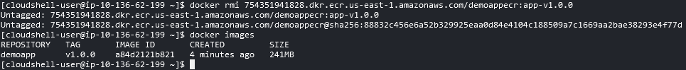

# Práctica 1. Creación e interacción con Amazon ECR

## Objetivo de la práctica:
Al finalizar la práctica, serás capaz de:
- Conocer cómo crear un repositorio en Amazon ECR.
- Subir (push) imágenes de contenedores al repositorio y descargar (pull) esas imágenes en un entorno de trabajo, utilizando comandos de la CLI y Docker.

## Objetivo Visual 


## Duración aproximada:
- 40 minutos.

## Tabla de ayuda:
| Región     | Usuario  |
|------------|----------|
| us-west-2  | student  |

## Instrucciones 

### Tarea 1. Creación de los archivos de la aplicación

En la siguiente tarea, prepararás los archivos demostrativos necesarios, como scripts, css e index, para la creación del contenedor Docker.

**NOTA:** A lo largo de la práctica habrá imágenes para que puedas apoyarte y mejorar la experiencia de configuración.

Paso 1. Iniciar sesión en **otra pestaña de tu navegador** y dar clic para abrir la cuenta de [**AWS**](https://us-east-2.signin.aws.amazon.com/oauth?client_id=arn%3Aaws%3Asignin%3A%3A%3Aconsole%2Fcanvas&code_challenge=O9XOfG1TAAeweXyB0WbmZbNsRtOhuxUkQSSJyXLAzcQ&code_challenge_method=SHA-256&response_type=code&redirect_uri=https%3A%2F%2Fconsole.aws.amazon.com%2Fconsole%2Fhome%3FhashArgs%3D%2523%26isauthcode%3Dtrue%26nc2%3Dh_ct%26src%3Dheader-signin%26state%3DhashArgsFromTB_us-east-2_039ecdfecdcea574)

Paso 2. Dentro de la página, usar las credenciales asignadas en el curso:

| Cuenta               | Usuario    | Contraseña              |
|----------------------|------------|-------------------------|
| **Asignada durante el curso** | **student** | **Asignada durante el curso** |


Paso 3. Clic en el botón **Sign in**

Paso 4. Una vez autenticado, verificar tu región. Para esta práctica lo harás en **Oregon**/**us-west-2**


Paso 5. En la barra superior derecha, dar clic en el ícono de **AWS Cloud Shell**, el cual abrirá un panel inferior con la **Terminal de AWS**


Paso 6. En la terminal vamos a **descargar los archivos**. **Escribir** el siguiente comando o puedes **copiarlo** si prefieres y dar **Enter**:

```
aws s3 cp s3://labs.netec.com/courses/AWS-ECS/v0.0.1/demoapp . --recursive
```

**NOTA:** El comando descargará los archivos de un bucket de S3 preparado para el curso:

| Archivo/Carpeta   | Descripción                                  |
|-------------------|----------------------------------------------|
| **css/**           | Contiene los estilos de la página demostrativa |
| **scripts/**       | Contiene una pequeña interacción en la página demostrativa |
| **index.html**     | Definición de la página demostrativa         |
| **workinprog.html**| Definición de la página en proceso de creación |


**NOTA:** En cualquier momento puedes usar el comando **`ls`** para verificar los resultados.


**¡TAREA FINALIZADA!**

> Haz completado la descarga de los archivos de la aplicación.

### Tarea 2. Creación de la imagen Docker

En esta tarea crearás el archivo Dockerfile para compilarlo y generar la imagen Docker.

Paso 1. Crear el archivo **Dockerfile**, dentro de la terminal de AWS, escribir el siguiente comando:

```
nano Dockerfile
```

Paso 2. Dentro del archivo **copiar** y **pegar** el siguiente código que define las instrucciones del Docker.

**NOTA IMPORTANTE:** En la sección **ZONA HORARIA** del archivo, **descomentar** y **comentar** la zona adecuada a la ubicación actual. **Si tienes dudas, pregunta al instructor**

```
FROM ubuntu:20.04

# Set the working directory.
#WORKDIR /usr/src/app

# Cambiar este valor de acuerdo a tu ZONA HORARIA.
ENV TZ=America/Mexico_City
#ENV TZ=America/Bogota

# Copy the file from your host to your current location.
COPY . /var/www/html/

#Instalar Dependencias.
RUN ln -snf /usr/share/zoneinfo/$TZ /etc/localtime && echo $TZ > /etc/timezone
RUN apt-get update -y \
    && apt-get install -y apache2 \
    && apt-get install -y tzdata

EXPOSE 80

CMD [ "apachectl", "-D", "FOREGROUND" ]
```

**NOTA:** Si aparece la siguiente imagen, dar clic en el botón **Paste**


Paso 3. Cuando ya estés listo, ejecutar las siguientes combinaciones de teclas en el siguiente orden:

**```CTRL + O```** **`Enter`** `Para guardar el archivo`

**```CTRL + X```** **`Enter`** `Para salir del archivo`

**NOTA:** Puedes escribir el siguiente comando despues de haber guardado el archivo para verificar el contenido **`cat Dockerfile`**.

Paso 4. Compilar la **imagen Docker** mediante el siguiente comando:

```
docker build -t demoapp:v1.0.0 .
```

Paso 5. Verificar que la compilación no tenga errores:


Paso 6. Verificar que la imagen se haya creado correctamente, **copia/escribe** el siguiente comando:

```
docker images
```


Paso 7. La imagen no podrá ser probada por el momento, ya que estás en la terminal de AWS.

**Continúa con la siguiente tarea**

**¡TAREA FINALIZADA!**

> Haz completado la creación de la imagen del contenedor.

### Tarea 3. Creación del registro Amazon ECR y carga de la imagen

En esta tarea crearás el repositorio privado en Amazon ECR y cargarás la imagen creada en la tarea anterior al repositorio.

Paso 1. Ir al buscador de AWS en la parte superior de la pantalla y escribir **`Elastic Container Registry`** y dar clic en el servicio.


Paso 2. En la página de bienvenida del servicio, dar clic en el botón **Create**.

**NOTA:** Solo en caso de que no aparezca el botón, dar **clic** en las **3 líneas** de la esquina **superior izquierda**, luego en la sección **Private registry**, opción **Repositories**, finalmente clic en **Create repository**.

Paso 3. En la sección **Repository name**, escribir el nombre del repositorio. Puedes apoyarte en la siguiente tabla:

| Propiedad| Valor | Descripcíon |
| --- | --- | --- |
| **Repository name** | **demoappecr**. Solo en caso de que no te deje crear el repositorio, agrega `3 números aleatorios` al final | Nombre del repositorio |
| **Image tag mutability** | **Immutable** | Imagen por cada cambio o imagen sobreescrita |
| **Encryption configuration** | **AES-256** | Encriptación en sitio para las imágenes |
| **Image Scanning settings** | Scan on push **ON** | Activación del escaneo de la imagen                  |


Paso 4. Clic en el botón **Create** y verificar la creación exitosa:


Paso 5. Ahora **autentificarse** al repositorio de **Amazon ECR**. De vuelta a la terminal, escribir el siguiente comando:

**NOTA:** Dentro del siguiente comando, identificar las siguientes propiedades: **`<region>`** (2) y **`<account-id>`** (1). **Sustitúyelos por los valores asignados al curso**.

**NOTA:** Puedes editar primero el comando en un bloc de notas y después pegarlo en la terminal.

```
aws ecr get-login-password --region <region> | docker login --username AWS --password-stdin <account-id>.dkr.ecr.<region>.amazonaws.com
```


Paso 6. Etiquetar la imagen antes de subirla como buena práctica, escribir el siguiente comando:

**NOTA:** Recuerda cambiar los valores **`<account-id>`**, **`<region>`** y **`<repository-name>`**.

```
docker tag demoapp:v1.0.0 <account-id>.dkr.ecr.<region>.amazonaws.com/<repository-name>:app-v1.0.0
```


**NOTA:** El comando no dará una salida, pero puedes validar el etiquetado escribiendo el siguiente comando: ```docker images```.

Paso 7. Proceder a **cargar la imagen Docker**, escribir el siguiente comando en la terminal **AWS Cloud Shell**:

**NOTA:** Sustituir los siguientes valores en tu bloc de notas: **`<account-id>`**, **`<region>`** y **`<repository-name>`**.

```
docker push <account-id>.dkr.ecr.<region>.amazonaws.com/<repository-name>:app-v1.0.0
```

Paso 8. Esperar el proceso de carga de la imagen.


Paso 9. Una vez cargada, verás el resultado como en la siguiente imagen:


Paso 10. Ahora, de vuelta a la **interfaz** del servicio **Amazon ECR**, dentro del repositorio llamado **demoappecr**, verás la imagen guardada.


Paso 11. Dar clic en el nombre de la imagen **app-v1.0.0** y analizar las propiedades de la imagen dentro del servicio.

**¡TAREA FINALIZADA!**

> Haz finalizado la creación del repositorio en Amazon ECR, la compilación y carga de una imagen Docker.

### Tarea 4. Descarga de la imagen Docker desde Amazon ECR.

En esta tarea realizarás la **descarga** de la imagen Docker desde Amazon ECR mediante la terminal de **AWS Cloud Shell**.

Paso 1. Primero, ir a la terminal de **AWS Cloud Shell** y copiar el siguiente comando para borrar la imagen:

**NOTA:** Recuerda cambiar los valores de tu **`<account-id>`** y **`<region>`**.

```
docker rmi <account-id>.dkr.ecr.<region>.amazonaws.com/demoappecr:app-v1.0.0
```

**NOTA:** Puedes usar el comando **`docker images`** para validar que se haya borrado correctamente.



Paso 2. ¡Muy bien! Ahora, ir a **Amazon ECR** > **clic** en tu repositorio > **clic** en la imagen cargada. Dentro de las propiedades de la imagen, copiar el siguiente valor:


Paso 3. Ya copiado, ir a la terminal de **AWS Cloud Shell** y escribir **`docker pull`** y **pegar** el valor de la **URI** de la imagen.

**NOTA:** Recuerda que para descargar la imagen debes estar autenticado. Si te da error de autenticación, realiza el paso **# 5** de la **Tarea #3**.


**¡TAREA FINALIZADA!**

> Haz terminado la tarea donde descargaste exitosamente la imagen desde el repositorio en **Amazon ECR**.

### Resultado final esperado

El resultado es que la imagen se haya cargado correctamente al repositorio de **Amazon ECR**.


