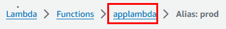
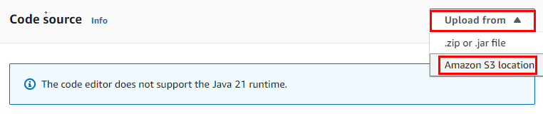

# Práctica2. Creación de una función AWS Lambda

## Objetivo de la práctica:
Al finalizar la práctica, serás capaz de:
- Crear una función AWS Lambda en el lenguaje de programación Java.
- Probar una función básica en AWS Lambda.

## Objetivo Visual 


## Duración aproximada:
- 40 minutos.

## Tabla de ayuda:
| Región  | Usuario |
|---------|---------|
| us-west-2 | student |

## Instrucciones 

### Tarea 1. Creación de la función AWS Lambda

En esta tarea explorarás la creación de la función Lambda y sus propiedades.

**NOTA:** A lo largo de la práctica habrá imágenes para que puedas apoyarte y mejorar la experiencia de configuración.

**NOTA:** Si ya estás autenticado al laboratorio, puedes avanzar al paso 4 y continuar desde ahí.

Paso 1. Iniciar sesión en la cuenta de [**AWS**](https://us-east-2.signin.aws.amazon.com/oauth?client_id=arn%3Aaws%3Asignin%3A%3A%3Aconsole%2Fcanvas&code_challenge=O9XOfG1TAAeweXyB0WbmZbNsRtOhuxUkQSSJyXLAzcQ&code_challenge_method=SHA-256&response_type=code&redirect_uri=https%3A%2F%2Fconsole.aws.amazon.com%2Fconsole%2Fhome%3FhashArgs%3D%2523%26isauthcode%3Dtrue%26nc2%3Dh_ct%26src%3Dheader-signin%26state%3DhashArgsFromTB_us-east-2_039ecdfecdcea574)

Paso 2. Dentro de la página, usar las credenciales asignadas en el curso:

| Cuenta | Usuario | Contraseña |
| --- | --- | --- |
| **Asignada durante el curso** | **student** | **Asignada durante el curso** |


Paso 3. Clic en el botón **Sign in**.

Paso 4. Una vez autenticado, verificar tu región; para esta práctica lo harás en **Oregon**/**us-west-2**.


Paso 5. Ir al buscador de AWS en la parte superior de la pantalla y escribir **`Lambda`** y dar clic en el servicio.


Paso 6. Dentro de la interfaz de la función Lambda, dar clic en el botón **Create function**.


Paso 7. En la siguiente ventana, definir las propiedades de la función como lo muestra la siguiente tabla:

**NOTA:** Todo lo que no esté definido se queda por defecto.

| Propiedad | Valor | Descripción |
| --- | --- | --- |
| **Create function** | **Author from scratch** | Tipo de plantilla a usar para la función Lambda |
| **Function name** | **applambda** | Nombre de la función |
| **Runtime** | **Java 21** | Selección del lenguaje de programación |


Paso 8. Dar clic en el botón **Create function**.


Paso 9. Puedes observar las opciones de la función Lambda creada; dar clic en cada opción:

| Propiedad | Descripción |
| --- | --- |
| **Code** | **El código fuente de la función Lambda.** |
| **Test** | **Proceso de ejecución para verificar el funcionamiento de la función.** | 
| **Monitor** | **Seguimiento del rendimiento y métricas de la función.** | 
| **Configuration** | **Ajustes de la función, como memoria y tiempos de ejecución.** | 
| **Aliases** | **Punteros a versiones específicas de una función Lambda.** | 
| **Versions** | **Iteraciones o versiones publicadas de una función Lambda.** | 


**¡TAREA FINALIZADA!**

> Has completado la creación de una función Lambda.

### Tarea 2. Ejecución de la función Lambda

En esta tarea usarás la Lambda creada previamente para ejecutarla y observar los resultados.

Paso 1. Dentro de la página de detalles de la función Lambda, dar clic en la opción **Test**.


Paso 2. En el panel inferior **Test event**, mantener seleccionada la opción **Create new event**.

Paso 3. En la propiedad **Event name**, escribir el siguiente nombre: **`dataevent`**.

Paso 4. Dejar el resto de los valores por defecto y dar clic en la opción **Test** en la parte superior derecha.


Paso 5. Una vez ejecutada la función, verás el resultado en la parte superior.


Paso 6. Dar clic en la opción **> Details** para expandir los detalles de la ejecución.


Paso 7. Analizar los resultados de la función y observar las siguientes propiedades:

- Duration
- Billed Duration
- Memory Size
- Max Memory Used
- Init Duration

Paso 8. Repetir el paso **4** al menos 6 veces más para realizar varias ejecuciones de la función.

Paso 9. Ahora, cambiar a la pestaña **Monitor** para ver las ejecuciones.


Paso 10. Observar las métricas de la función Lambda por las ejecuciones.

**NOTA:** Actualiza varias veces las gráficas, ya que los eventos tardan un momento en aparecer.


Paso 11. Dar clic en el botón **View CloudWatch logs** para ver los logs generados por la Lambda.


Paso 12. En la siguiente ventana, en la parte inferior estarán el o los **Log streams**. Dar clic en el primero que aparezca.


Paso 13. Dentro del stream, te mostrará todos los mensajes/eventos de la función; puedes expandir los mensajes para ver los detalles.


**¡TAREA FINALIZADA!**

> Haz completado la ejecución y monitoreo de la función Lambda.

### Tarea 3. Versión y aliases en Lambda

En esta tarea crearás una versión de la función Lambda y apuntarás a un alias para identificarla mejor.

Paso 1. Ir a la sección de **Aliases**.


Paso 2. Dar clic en el botón lateral derecho **Create alias**.


Paso 3. Configurar los siguientes datos como lo muestra la tabla:

| Propiedad | Valor |
| --- | --- |
| **Name** | prod |
| **Description** | Función principal | 
| **Version** | $LATEST | 


Paso 4. Clic en el botón **Save**.

Paso 5. Regresar a la función raíz dando clic en el menú superior **applambda**.



Paso 6. Seleccionar la opción de **Versions**.


Paso 7. Dar clic en el botón lateral derecho **Publish new version**.

Paso 8. En la ventana emergente, escribir la versión: **`1.1.0`** y dar clic en el botón **Publish**.

Paso 9. Dentro de las propiedades de la función Lambda con la versión creada, dar clic en el botón **Actions**.

**NOTA:** El número de la versión puede cambiar dependiendo de las implementaciones.

Paso 10. En el submenú elegir **Create alias**.


Paso 11. Escribir los siguientes datos para el alias.

**NOTA:** Recuerda que el valor de la versión puede ser diferente dependiendo de las veces implementada. 

| Propiedad | Valor |
| --- | --- |
| **Name** | dev |
| **Description** | Función de desarrollo | 
| **Version** | **1** (Puede ser diferente, puedes guiarte mediante la descripción **1.1.0**) |


Paso 12. Dar clic en el botón **Save**.

Paso 13. Regresar a la función raíz dando clic en el menú superior **applambda**.

Paso 14. Dar clic en la sección de **Aliases** para ver los 2 aliases creados como en la siguiente imagen.


Paso 15. Dar clic en la opción **Versions**.


**¡TAREA FINALIZADA!**

> Has completado la creación de versiones y alias en la función Lambda.

### Tarea 4. Actualización de la función Lambda

En esta tarea publicarás un nuevo código en la versión de la función Lambda y probarás el resultado.

Paso 1. Da clic en la sección de **Code**.


Paso 2. Dar clic en la opción **Upload from** y en el menú desplegable seleccionar **Amazon S3 location**.



Paso 3. En la ventana emergente colocar la siguiente URL que actualizará el código y dar clic en el botón **Save**.

```
https://s3.us-west-2.amazonaws.com/labs.netec.com/courses/AWS-ECS/v0.0.1/lambda-java-example-1.0-SNAPSHOT.jar
```

**NOTA:** Puedes analizar los siguientes archivos para comprender la funcionalidad de la actualización de Lambda. **Ya el código está compilado en el archivo JAR que está guardado en el S3.**

**Archivo pom.xml**
> Recuerda que son archivos de lectura.

```
<project xmlns="http://maven.apache.org/POM/4.0.0" xmlns:xsi="http://www.w3.org/2001/XMLSchema-instance"
    xsi:schemaLocation="http://maven.apache.org/POM/4.0.0 http://maven.apache.org/xsd/maven-4.0.0.xsd">
    <modelVersion>4.0.0</modelVersion>
    <groupId>com.example</groupId>
    <artifactId>lambda-java-example</artifactId>
    <version>1.0-SNAPSHOT</version>
    <properties>
        <maven.compiler.source>21</maven.compiler.source>
        <maven.compiler.target>21</maven.compiler.target>
        <version>3.10.1</version>
    </properties>

    <dependencies>
        <!-- AWS Lambda Core -->
        <dependency>
            <groupId>com.amazonaws</groupId>
            <artifactId>aws-lambda-java-core</artifactId>
            <version>1.2.1</version>
        </dependency>

        <!-- AWS Lambda Events (to handle JSON input/output) -->
        <dependency>
            <groupId>com.amazonaws</groupId>
            <artifactId>aws-lambda-java-events</artifactId>
            <version>3.11.0</version>
        </dependency>

        <!-- Jackson library for JSON processing -->
        <dependency>
            <groupId>com.fasterxml.jackson.core</groupId>
            <artifactId>jackson-databind</artifactId>
            <version>2.15.0</version>
        </dependency>
        <!-- Dependencia de JUnit 4 para pruebas unitarias -->
        <dependency>
            <groupId>junit</groupId>
            <artifactId>junit</artifactId>
            <version>4.13.2</version>
            <scope>test</scope>
        </dependency>
    </dependencies>

    <build>
        <plugins>
            <plugin>
                <groupId>org.apache.maven.plugins</groupId>
                <artifactId>maven-shade-plugin</artifactId>
                <version>3.2.4</version>
                <executions>
                    <execution>
                        <phase>package</phase>
                        <goals>
                            <goal>shade</goal>
                        </goals>
                        <configuration>
                            <createDependencyReducedPom>false</createDependencyReducedPom>
                        </configuration>
                    </execution>
                </executions>
            </plugin>
        </plugins>
    </build>
</project>
```

**Archivo LambdaHandler.java**
> Recuerda son archivos de lectura.

```
package com.example;

import com.amazonaws.services.lambda.runtime.Context;
import com.amazonaws.services.lambda.runtime.RequestHandler;
import java.util.Map;

public class LambdaHandler implements RequestHandler<Map<String, Object>, String> {

    @Override
    public String handleRequest(Map<String, Object> event, Context context) {
        // Extraer datos del evento JSON
        String message = (String) event.getOrDefault("message", "Hola Mundo");

        // Registrar la entrada para fines de monitoreo
        context.getLogger().log("Evento recibido: " + event.toString());

        // Devolver un mensaje simple
        return "Mensaje procesado: " + message;
    }
}
```

Paso 4. Una vez guardada la actualización de código, ir a la propiedad de **Runtime settings** en la parte inferior.


Paso 5. Dar clic en el botón **Edit** y ajustar la propiedad **Handler**. Escribe lo siguiente: **`com.example.LambdaHandler::handleRequest`**.


Paso 6. Clic en el botón **Save**.

Paso 7. Ir a la sección de **Versions** dentro de la Lambda.

Paso 8. Clic en el botón **Publish new version** y en la ventana emergente escribir: **1.1.1**.

Paso 9. Clic en el botón **Publish**.

Paso 10. Dar clic en el menú **Actions** de la parte superior derecha, en el menú desplegable selecciona **Create alias**.

Paso 11. En la ventana emergente escribe lo siguiente:

| Propiedad | Valor |
| --- | --- |
| **Name** | test |
| **Description** | Prueba de la actualización | 
| **Version** | **2** La más reciente | 


Paso 12. Clic en el botón **Save**.

Paso 13. Dar clic en el menú superior para regresar a la Lambda **applambda** y seleccionar la opción inferior **Versions**.

Paso 14. Dar clic en el hipervínculo del número **2** de la versión que aparece.

Paso 15. Dar clic en la opción **Test**, escribir el nombre del evento **dataevent**.


Paso 16. En la sección inferior **Event JSON** borrar todo, copiar el siguiente código y pegarlo:

```
{
  "message": "Este es un mensaje de prueba"
}
```

Paso 17. Finalmente, dar clic en el botón superior **Test** y verás el resultado procesado por la nueva función.


**NOTA:** Prueba cambiar el texto del evento JSON a otro contenido para que la Lambda ajuste e imprima el resultado.

**¡TAREA FINALIZADA!**

> Haz completado la publicación de la actualización de la función Lambda asociándola a diferentes versiones y aliases.

### Resultado final esperado

El resultado esperado es el funcionamiento correcto de todas las tareas y la ejecución de la función Lambda.


