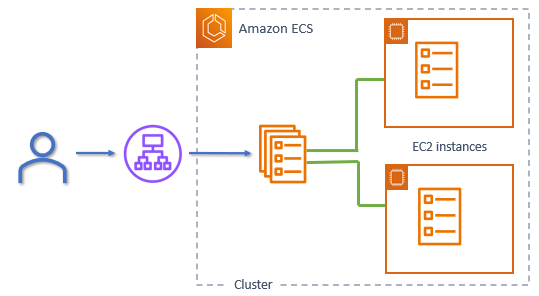
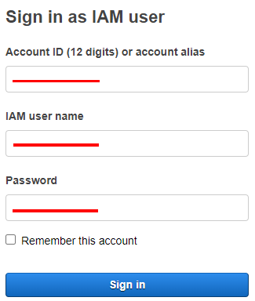
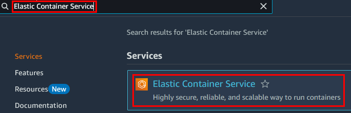
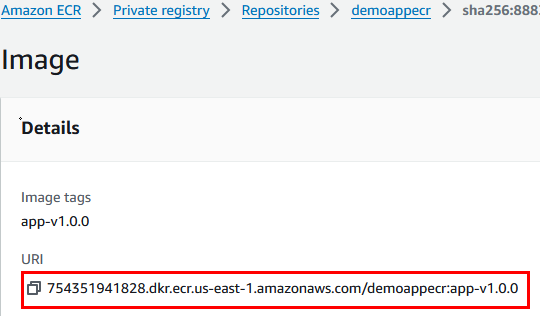
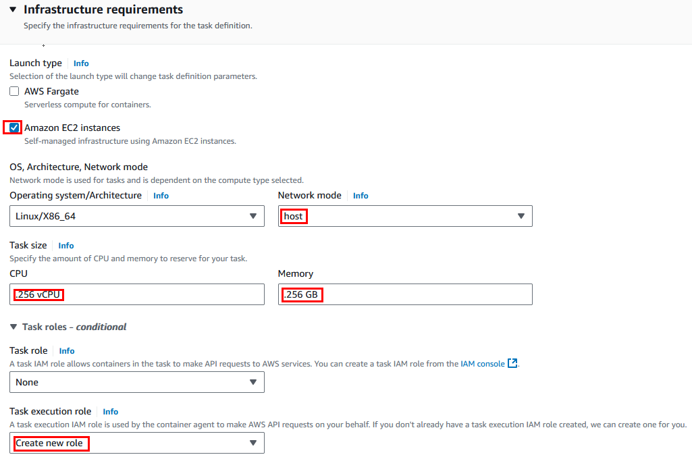
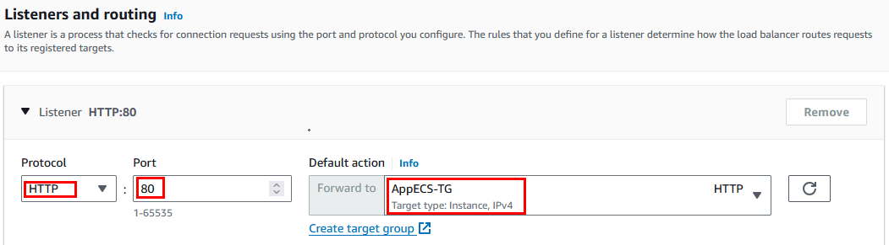
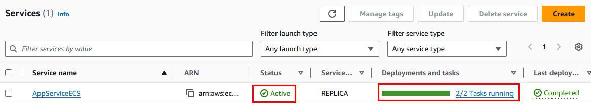

# Práctica 3. Creación de un clúster de Amazon ECS altamente disponible 

## Objetivo de la práctica:
Al finalizar la práctica, serás capaz de:
- Implementar un clúster de Amazon ECS altamente disponible.
- Desplegar un contenedor Docker en el clúster ECS.

## Objetivo Visual 

## Duración aproximada:
- 60 minutos.

## Tabla de ayuda:
| Región | Usuario |
| --- | --- |
| us-west-2 | student |

## Instrucciones 

### Tarea 1. Creación de un clúster de Amazon ECS.

En esta tarea crearás un clúster de Amazon ECS.

**NOTA:** A lo largo de la práctica habrá imágenes para que puedas apoyarte y mejorar la experiencia de la configuración.

**NOTA:** Si ya estás autenticado al laboratorio, puedes avanzar al paso 4 y continuar desde ahí.

Paso 1. Inicia sesión en la cuenta de [**AWS**](https://us-east-2.signin.aws.amazon.com/oauth?client_id=arn%3Aaws%3Asignin%3A%3A%3Aconsole%2Fcanvas&code_challenge=O9XOfG1TAAeweXyB0WbmZbNsRtOhuxUkQSSJyXLAzcQ&code_challenge_method=SHA-256&response_type=code&redirect_uri=https%3A%2F%2Fconsole.aws.amazon.com%2Fconsole%2Fhome%3FhashArgs%3D%2523%26isauthcode%3Dtrue%26nc2%3Dh_ct%26src%3Dheader-signin%26state%3DhashArgsFromTB_us-east-2_039ecdfecdcea574)

Paso 2. Dentro de la página usar las credenciales asignadas en el curso:

| Cuenta | Usuario | Contraseña |
| --- | --- | ---|
| **Asignada durante el curso** | **student** | **Asignada durante el curso** |

Paso 3. Clic en el botón **Sign in**.

Paso 4. Una vez autenticado, verificar tu región; para esta práctica lo harás en **Oregon**/**us-west-2**.

Paso 5. Ir al buscador de AWS en la parte superior de la pantalla y escribir **`Elastic Container Service`** y dar clic en el servicio.

Paso 6. Dentro de la interfaz del servicio **Amazon Elastic Container Service**, dar clic en el botón **Create cluster**.

**NOTA:** **Si la opción no aparece**, dar clic en el menú hamburguesa lateral superior izquierdo y selecciona **Clusters**.

Paso 7. Definir las siguientes propiedades en la sección **Cluster configuration** para crear el clúster de Amazon ECS:

| Propiedad | Valor | Descripción |
| --- | --- | ---|
| **Cluster name** | **AppCluster** | Nombre del clúster |
| **Default namespace - optional** | Se queda el valor por defecto | Nombre del grupo de servicios de la aplicación |

Paso 8. En la sección **Infrastructure** definir lo siguiente:

| Propiedad | Valor | Descripción |
| --- | --- | ---|
| **Infrastructure** | **Amazon EC2 instances** | Tipo de servidores a utilizar en el clúster |
| **Auto Scaling group (ASG)** | **Create new ASG** | Instancias Amazon EC2 pago por uso |
| **Provisioning model** | **On-demand** | Creación del grupo ASG altamente disponible |
| **Container instance Amazon Machine Image (AMI)** | **Amazon Linux 2 (kernel 5.10)** | Tipo de AMI, siempre la más reciente |
| **EC2 instance type** | **t2.micro** | Familia de instancias de EC2 para propósitos generales o demostraciones |
| **EC2 instance role** | **InstanceRoleECS** | Role para permisos IAM y comunicación entre servicios. |
| **Desired capacity** | **Minimum = 2**, **Maximum = 5** | El clúster será altamente disponible. |
| **Root EBS volume size** | **30** | Mínimo tamaño del disco por servidor EC2 |

**NOTA:** Recuerda que todo valor no definido se queda por defecto.

Paso 9. Continúar con la sección **Network settings for Amazon EC2 instances** y seleccionar lo siguiente:

| Propiedad | Valor | Descripción |
| --- | --- | ---|
| **VPC** | **LabVPC** | Virtual Private Cloud para lanzar los servidores EC2 |
| **Subnets** | **Private Subnet 1**, **Private Subnet 2** | Subredes privadas para crear los servidores EC2 seguros. |
| **Security group** - **Use an existing security group** | **ContainerSG** | Definición de las reglas del firewall para los servidores EC2 |

**NOTA:** Recuerda solo seleccionar lo que indica la tabla, lo demás se puede remover; puedes apoyarte de la imagen:

Paso 10. Clic en el botón **Create**.

**NOTA:** El clúster empezará a crearse, puede tardar entre **1 a 5 minutos**.

Paso 11. Dar clic en el botón **Actualizar** y después clic en el nombre del clúster **AppCluster**.

Paso 12. Dar clic en el nombre del cluster **AppCluster** y verificar que el clúster esté activo.

**¡TAREA FINALIZADA!**

> Haz completado la creación de un clúster de Amazon ECS.

### Tarea 2. Obtención de la URI del contenedor.

Paso 1. Ir al buscador de AWS en la parte superior de la pantalla y escribir **`Elastic Container Registry`**. Dar clic derecho y seleccionar **Abrir enlace en una pestaña nueva**.

Paso 2. Clic en el nombre de tu repositorio **demoappecr**.

Paso 3. Clic en el nombre de la imagen **app-v1.0.0**.

Paso 4. Copiar el valor de la propiedad **URI** y guardalor en un **bloc de notas**.

**¡TAREA FINALIZADA!**

> Haz completado la obtención y el guardado de la URI del contenedor para usar en la siguiente tarea.

### Tarea 3. Creación de la definición de la tarea (Contenedor)

En esta tarea definirás el contenedor a usar mediante la propiedad Task Definition del servicio Amazon ECS.

Paso 1. Repetir el paso **5 de la tarea 1**. En el menú lateral izquierdo del servicio **Amazon ECS** dar clic en la opción **Task definitions**.

Paso 2. Dar clic en **Create new task definition**.

Paso 3. Dentro de la sección **Task definition configuration** configurar lo siguiente:

| Propiedad | Valor | Descripción |
| --- | --- | ---|
| **Task definition family** | **AppContainerTask** | Nombre de la tarea (Contenedor) para Amazon ECS |

Paso 4. En la sección **Infrastructure requirements** configurar lo siguiente.

| Propiedad | Valor | Descripción |
| --- | --- | ---|
| **Launch type** | **Amazon EC2 instances** | Definir la infraestructura donde se lanzará la tarea |
| **Network mode** | **host** | Comunicación entre el host y el contenedor |
| **Task size** | **CPU = .256 vCPU** - **Memory = .256 GB** | Recursos totales del servidor |
| **Task execution role** | **Create new role** | Define los permisos que puede usar el contenedor con otros servicios de AWS |

**NOTA:** El resto de los valores quedará por defecto.

Paso 5. En la sección **Container - 1** definir lo siguiente.

| Propiedad | Valor | Descripción |
| --- | --- | ---|
| **Container details - Name** | **appcontainer** | Nombre del contenedor |
| **Container details - Image URI** | **Pega el valor que guardaste en tu bloc de notas** | Definición de la URI del contenedor en la tarea de Amazon ECS |
| **Port mappings - Container port** | **80** | Puerto del contenedor |
| **Port mappings - Protocol** | **TCP** | Protocolo |
| **Port mappings - Port name** | **http** | Nombre del puerto |
| **Port mappings - App protocol** | **HTTP** | Protocolo de la aplicación |
| **Resource allocation limits - conditional - CPU** | **0.100** | CPU |
| **Resource allocation limits - conditional - Memory hard limit** | **0.256** | Memoria máxima total |
| **Resource allocation limits - conditional - Memory soft limit** | **0.128** | Memoria máxima que el contenedor puede usar |

**NOTA:** El resto de los valores se quedará por defecto.

Paso 6. Clic en el botón **Create**.

Paso 7. Verificar el estado de la tarea creada.

**¡TAREA FINALIZADA!**

> Haz completado la definición del contenedor mediante la tarea de Amazon ECS.

### Tarea 4. Creación de un Target Group.

En la siguiente tarea crearás el Target Group que referenciará los servidores de EC2 desplegados por el servicio de Amazon ECS.

Paso 1. En el buscador de AWS en la parte superior de la pantalla escribir **`Elastic Compute Cloud`** y dar clic en el servicio.

Paso 2. En la sección de **Load Balancing** del menú lateral izquierdo dar clic en la opción **Target Groups**.

Paso 3. Dar clic en el botón **Create target group** y configurar lo siguiente:

| Propiedad | Valor | Descripción |
| --- | --- | ---|
| **Choose a target type** | **Instances** | Tipo de infraestructura |
| **Target group name** | **AppECS-TG** | Nombre del target group |
| **VPC** | **LabVPC** | Nombre de la VPC |

**NOTA:** El resto de los valores se queda por defecto.

Paso 4. Clic en el botón **Next**.

Paso 5. En la sección **Available instances** deben estar los 2 servidores del clúster de Amazon ECS, seleccionar los 2 servidores.

Paso 6. Dar clic en el botón inferior **Include as pending below** y los verás en la sección **Targets** como lo muestra la imagen.

Paso 7. Clic en el botón **Create target group**.

Paso 8. Los servidores estarán en el estado **Unused** ya que no está creado el balanceador de carga, es normal.

Paso 9. Dar clic en la opción **Auto Scaling Groups** de la sección **Auto Scaling** del menú lateral izquierdo hasta abajo **ABRELO EN OTRA PESTAÑA**.

Paso 10. Clic en el nombre del grupo de auto scaling que comienza con **Infra...**, debería de ser el único grupo.

Paso 11. Deslizar la página hacia abajo casi a la mitad para encontrar la opción **Load balancing** y dar clic en el botón **Edit**.

Paso 12. Configurar el **Target Group** como lo muestra la imagen y dar clic en el botón **Update**.

**¡TAREA FINALIZADA!**

> Haz completado la creación del Target Group y la asociación al grupo de auto escalabilidad.

### Tarea 5. Creación de un Application Load Balancer

En la siguiente tarea asociarás el balanceador de carga para que distribuya el tráfico a los servidores registrados en el Target Group.

Paso 1. Dar clic en la opción **Load Balancers** de la sección **Load Balancing** en el menú lateral izquierdo.

Paso 2. Clic en el botón **Create load balancer**.

Paso 3. Clic en el botón **Create** de la sección **Application Load Balancer**.

Paso 4. Configurar lo siguiente en la sección **Basic configuration**:

| Propiedad | Valor | Descripción |
| --- | --- | ---|
| **Load balancer name** | **AppECS-LB** | Nombre del balanceador |

Paso 5. En la sección **Network mapping** configurar:

| Propiedad | Valor | Descripción |
| --- | --- | ---|
| **VPC** | **LabVPC** | Nombre de la VPC |
| **Availability Zones** - **us-east-1a** | **Public Subnet 1** | Subred pública 1 donde se implementará el balanceador |
| **Availability Zones** - **us-east-1b** | **Public Subnet 2** | Subred pública 2 donde se implementará el balanceador |

Paso 6. En la sección **Security groups** configurar:

| Propiedad | Valor | Descripción |
| --- | --- | ---|
| **Security groups** | **AppLBSG** | Nombre del grupo de seguridad para el balanceador |

Paso 7. En la sección **Listeners and routing** configurar como lo muestra la imagen:

**NOTA:** El resto de los valores se quedan por defecto.

Paso 8. Finalmente clic en el botón **Create load balancer**.

**NOTA:** El balanceador tardará de **1 a 5 minutos**, espera la creación.

Paso 9. Cuando el estado del balanceador sea **Activo**, copiar el DNS y guardarlo en tu **bloc de notas**, lo ocuparás más adelante.

**¡TAREA FINALIZADA!**

> Haz completado la creación del balanceador de carga.

### Tarea 6. Despliegue del servicio (Contenedor)

En esta tarea crearás el servicio que desplegará la tarea en los servidores.

Paso 1. Ir al buscador de AWS en la parte superior de la pantalla y escribir **`Elastic Container Service`** y dar clic en el servicio.

**NOTA:** En el menú lateral izquierdo selecciona **Clusters** y da clic en el nombre de tu clúster **AppCluster**.

Paso 2. En la parte inferior de los detalles de tu clúster seleccionar **Services** y dar clic en el botón **Create**.

Paso 3. En la sección **Environment** mantere seleccionada la opción **Launch type** y en **Launch Type** usar **EC2**.

Paso 4. En la propiedad **Deployment configuration** definir lo siguiente.

| Propiedad | Valor | Descripción |
| --- | --- | ---|
| **Application type** | **Service** | Grupo de tareas (Contenedores) |
| **Family** | **AppContainerTask** | Tarea |
| **Service name** | **AppServiceECS** | Nombre del servicio |
| **Service type** | **Replica** | Modo de despliegue de tareas |
| **Desired tasks** | **2** | Cantidad de tareas |

Paso 5. En la sección de **Load balancing - optional** configurar lo siguiente.

| Propiedad | Valor | Descripción |
| --- | --- | ---|
| **Load balancer type** | **Application Load Balancer** | Tipo de balanceador |
| **Load balancer** | **AppEcs-LB** | Selección del balanceador existente |
| **Listener** | **Use an existing listener** | Selección del Listener existente |
| **Listener** | **80:HTTP** | Selección del Listener existente |
| **Target group** | **Use an existing target group** | Selección del Target group existente |
| **Target group name** | **AppECS-TG** | Selección del target group existente |

**NOTA:** El resto de los valores se quedan por defecto.

Paso 6. Dar clic en el botón **Create**.

**NOTA:** El despliegue puede tardar unos minutos. Esperar el despliegue.

Paso 7. Mientras se realiza la implementación, puedes dar clic en el botón de actualización.

**NOTA:** Después de unos minutos aparecerá el servicio.

Paso 8. El servicio desplegará las tareas dentro de los servidores, **espera unos minutos más** y verificar el estado exitoso de las 2 tareas (1 por cada servidor).

**¡TAREA FINALIZADA!**

> Haz completado la creación del servicio que despliega los contenedores en los servidores EC2.

### Tarea 7. Prueba de la Aplicación altamente Disponible.

Paso 1. Abrir una **pestaña nueva** en tu navegador u otro que tengas disponible y ahí **pegar el DNS** del balanceador que guardaste en el bloc de notas.

Paso 2. El resultado deberá ser la página web desplegada, como lo muestra la imagen.

**NOTA:** La página no tiene funcionalidad, es solo demostrativa para el ejemplo del laboratorio.

### Resultado final esperado

El resultado deberá ser la visualización de la página web desplegada por los contenedores y todos los pasos realizados correctamente.

