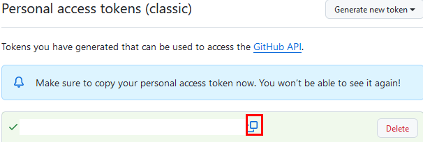
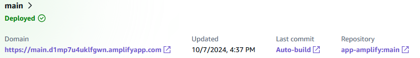

# Práctica 4. Despliegue de una aplicación mediante AWS Amplify

## Objetivo de la práctica:
Al finalizar la práctica, serás capaz de:
- Implementar un entorno de desarrollo en AWS Amplify.
- Desplegar la aplicación mediante AWS Amplify.

## Objetivo Visual 


## Duración aproximada:
- 40 minutos.

## Tabla de ayuda:
| Región | Usuario |
| -------| ------- |
| us-west-2 | student |

## Instrucciones 

### Tarea 1. Creación o autenticación de GitHub.

En esta tarea crearás una cuenta de GitHub o te autenticarás para cargar el proyecto de AWS Amplify.

**NOTA:** A lo largo de la práctica habrá imágenes para que puedas apoyarte y mejorar la experiencia de la configuración.

**NOTA:** Si ya estás autenticado al laboratorio, puedes avanzar al paso 4 y continuar desde ahí.

Paso 1. Primero inicia sesión en la cuenta de [**AWS**](https://us-east-2.signin.aws.amazon.com/oauth?client_id=arn%3Aaws%3Asignin%3A%3A%3Aconsole%2Fcanvas&code_challenge=O9XOfG1TAAeweXyB0WbmZbNsRtOhuxUkQSSJyXLAzcQ&code_challenge_method=SHA-256&response_type=code&redirect_uri=https%3A%2F%2Fconsole.aws.amazon.com%2Fconsole%2Fhome%3FhashArgs%3D%2523%26isauthcode%3Dtrue%26nc2%3Dh_ct%26src%3Dheader-signin%26state%3DhashArgsFromTB_us-east-2_039ecdfecdcea574)

Paso 2. Dentro de la página usar las credenciales asignadas en el curso:

| Cuenta | Usuario | Contraseña |
| --- | --- | ---|
| **Asignada durante el curso** | **student** | **Asignada durante el curso** |


Paso 3. Clic en el botón **Sign in**.

Paso 4. Una vez autenticado, verificar tu región; para esta práctica lo harás en **Oregon**/**us-west-2**. También puedes consultar la tabla de ayuda.


Paso 5. Abrir otra pestaña en tu mismo navegador y entrar a la página de **GitHub** o dar clic [**Aquí**](https://github.com/).

Paso 6. En la página de bienvenida de **GitHub**, crear una cuenta **si no tienes una**, colocando tu correo electrónico, **`puede ser personal o corporativo`**.

**NOTA:** Asegúrate de tener permisos administrativos para tu cuenta.


**NOTA:** Continúa con los pasos de la creación de la cuenta.

Paso 7. Si ya tienes una cuenta, dar clic [**Aquí**](https://github.com/login) para autenticarte.

Paso 8. En el panel principal de tu cuenta de GitHub, una vez autenticado, dar clic en **Create new repository** o **Create repository**.

Paso 9. En la sección **Create a new repository**, configurar lo siguiente:

| Propiedad | Valor | Descripción |
| --- | --- | ---|
| **Repository name** | **lab4-amplify-XXXX** (sustituye las **X** por letras y números aleatorios). | Nombre del repositorio |

**NOTA:** El resto de los valores se quedará por defecto.


Paso 10. Clic en el botón **Create repository**.

Paso 11. Copiar la **URL** de clonación de tu repositorio; la usarás más adelante. **Guárdala en un bloc de notas**.


Paso 12. Clic en el nombre **creating a new file**.


Paso 13. Escribir el nombre del archivo **`demofile.txt`** y el texto **`First File`**, y dar clic en el botón **Commit changes**.


Paso 14. Confirmar la ventana emergente **Commit changes**.

Paso 15. Ir al ícono de tu **perfil de GitHub** en la esquina superior derecha. 


Paso 16. En el menú, dar clic en **Settings**.


Paso 17. En el menú lateral izquierdo, **hasta el final**, encontrarás la opción **Developer settings**; dar clic.

Paso 18. Seleccionar **Personal access tokens** y luego **Tokens (classic)**.


Paso 19. Generar un nuevo token en la opción **Generate new token** y luego **Generate new token (classic)**.


Paso 20. Configurar como aparece en la imagen; el resto de los valores **se quedarán por defecto**.


Paso 21. Dar clic en el botón **Generate token** al final de la página.

Paso 22. Una vez generado, **guardar el token en tu bloc de notas**; lo usarás más adelante.



**¡TAREA FINALIZADA!**

> Haz completado la creación/autenticación al repositorio de GitHub.

### Tarea 2. Definición de la aplicación en React

En esta tarea crearás el proyecto de la aplicación simple mediante React.

Paso 1. Volver a la página de la **Consola de AWS**.

**NOTA:** Si por error cerraste la página, repetir los **pasos 1 a 3 de la tarea 1**.

Paso 2. Dar clic en el ícono de **AWS Cloud Shell**.


Paso 3. En la terminal, escribir el siguiente comando que creará la estructura del proyecto **React básico**.

```
npx create-react-app app-amplify
```


**NOTA:** Si te pide confirmar los paquetes a instalar, escribe **y**.

Paso 4. Comenzar la descarga e instalación de los paquetes.


**NOTA:** Esperar el proceso de inicialización; puede tardar de **1 a 5 minutos**.

Paso 5. Una vez terminado, puedes escribir el comando **`ls`** para ver el directorio.

Paso 6. Ingresar al directorio creado, escribir el comando: **`cd app-amplify`**.

Paso 7. **Repite el paso 5** para ver el interior del directorio.

Paso 8. Entrar a la carpeta **src**, escribir el comando: **`cd src`**.

Paso 9. Dentro de la carpeta, ajustar el archivo llamado **App.js**; escribir el siguiente comando.

```
nano App.js
```

**NOTA:** Borra todo el contenido.

Paso 10. Copiar el siguiente código y pegarlo dentro del archivo.

```
import './App.css'; // Asegúrate de importar el archivo CSS

function App() {
  return (
    <div className="App">
      <header className="App-header">
        <h1>Despliegue de React con AWS Amplify</h1>
        <p>¡Felicidades! haz desplegado una aplicación React básica en AWS Amplify.</p>
        <button className="btn-primary">Aprender más</button>
      </header>
    </div>
  );
}

export default App;
```

**NOTA:** Recuerda confirmar la ventana emergente, clic en el botón **Paste**.


**```CTRL + O```** **`Enter`** `Para guardar el archivo`

**```CTRL + X```** **`Enter`** `Para salir del archivo`

Paso 11. Ajustamos un archivo más llamado **App.css**.

Paso 12. Escribir el siguiente comando para editarlo:

```
nano App.css
```

**NOTA:** Borra todo el contenido.

Paso 13. Copiar el siguiente código y pegarlo dentro del archivo.

```
.App {
  text-align: center;
  height: 100vh;
  display: flex;
  justify-content: center;
  align-items: center;
  background: linear-gradient(135deg, #6a11cb 0%, #2575fc 100%);
  color: white;
  font-family: 'Arial', sans-serif;
}

.App-header {
  background-color: rgba(255, 255, 255, 0.1);
  padding: 40px;
  border-radius: 15px;
  box-shadow: 0 10px 30px rgba(0, 0, 0, 0.1);
}

h1 {
  font-size: 3rem;
  margin-bottom: 20px;
}

p {
  font-size: 1.5rem;
  margin-bottom: 20px;
}

.btn-primary {
  background-color: #ff4081;
  color: white;
  padding: 10px 20px;
  font-size: 1.2rem;
  border: none;
  border-radius: 25px;
  cursor: pointer;
  transition: background-color 0.3s ease;
}

.btn-primary:hover {
  background-color: #ff1c63;
}
```

**NOTA:** Recuerda confirmar la ventana emergente, clic en el botón **Paste**.

**```CTRL + O```** **`Enter`** `Para guardar el archivo`

**```CTRL + X```** **`Enter`** `Para salir del archivo`

**¡TAREA FINALIZADA!**

> Haz completado la descarga de los paquetes con React y los ajustes de la aplicación básica.

### Tarea 3. Carga de archivos a GitHub.

En esta tarea cargarás los archivos al repositorio creado en la tarea 1.

Paso 1. Regresar a la raíz de la carpeta del proyecto, escribir el comando:

```
cd ../../app-amplify
```


Paso 2. Dentro del directorio **app-amplify** escribir los siguientes comandos (uno por uno):

```
git init
```
```
git config --global init.defaultBranch main
```
```
git checkout -b main
```

**NOTA:** Si te sale la siguiente salida, puedes omitirla por el momento.


Paso 3. **Editar la propiedad TU_URL_REPO** del siguiente comando para asociar el repositorio remoto con el local **sustituyela por la que guardaste en la tarea 1**:

```
git remote add origin TU_URL_REPO
```


Paso 4. Escribir el siguiente comando para sincronizar los cambios de los repositorios remoto y local:

```
git pull origin main --allow-unrelated-histories
```


Paso 5. Escribir el comando para agregar los archivos y comenzar a rastrear los cambios:

```
git add .
```

Paso 6. Configurar los siguientes datos de tu **cuenta de GitHub**:

```
git config --global user.email "tu_correo_github@example.com"
git config --global user.name "tu_usuario_github"
```

Paso 7. Escribir el comando para rastrear los cambios de los archivos agregados.

```
git commit -m "Carga inicial del proyecto app-amplify"
```


Paso 8. Escribir el siguiente comando para subir los archivos rastreados al repositorio remoto.

```
git push origin main
```

**NOTA:** Te pedirá los datos de tu cuenta de GitHub, **username** y **contraseña**. La contraseña es **tu token** guardado en tu bloc de notas en la tarea 1.

**NOTA IMPORTANTE:** Al ser un campo de contraseña no la veras escrita por seguirdad solo pegala una vez.


Paso 9. Verificar en tu **cuenta de GitHub** que los archivos hayan sido cargados correctamente, como lo muestra la imagen.


**¡TAREA FINALIZADA!**

> Haz completado la carga de los archivos al repositorio de GitHub.

### Tarea 3. Creación del proyecto de AWS Amplify

En esta tarea crearás el proyecto de AWS Amplify para el despliegue de la aplicación.

Paso 1. Ir al buscador de AWS en la parte superior de la pantalla y escribir **`AWS Amplify`** y dar clic en el servicio.


Paso 2. En la página de bienvenida dar clic en el botón **Deploy an app**.


Paso 3. En la opción **Deploy your app** de la sección **Start building with Amplify** dar clic en **GitHub**.


Paso 4. Clic en el botón **Next**.

Paso 5. En la ventana emergente te pedirá **autorización** a tu repositorio de GitHub, seleccionar tu cuenta de GitHub.


Paso 6. En la siguiente ventana, seleccionar solo el repositorio creado para el laboratorio y dar clic en el botón **Install & Authorize**. Puedes apoyarte de la imagen.


Paso 7. De vuelta a **AWS Amplify**, en la sección **Add repository and branch** seleccionar tu repositorio y tu rama.


Paso 8. Clic en el botón **Next**.

Paso 9. En la sección **App settings**, cambiar el valor de **App name** y escribir el nuevo nombre.

**NOTA:** AWS Amplify detectará automáticamente que es una aplicación React.

```
app-amplify
```

Paso 10. Dar clic en el botón **Next**.

Paso 11. Revisar los detalles finales y dar clic en el botón **Save and deploy**.

Paso 12. AWS Amplify comenzará con el despliegue, como lo muestra la imagen.

**NOTA:** Puede tardar de **1 a 3 minutos**.


Paso 13. Ya desplegado, el resultado será como la imagen.



Paso 14. Dar clic en el link de la propiedad **Domain**, como se muestra en la imagen.


Paso 15. El resultado será la página de ejemplo en React.


**NOTA:** Si aún te queda tiempo, puedes explorar las opciones de AWS Amplify.

**¡TAREA FINALIZADA!**

> Haz completado el despliegue de la aplicación en AWS Amplify.

### Resultado final esperado

El resultado es la ejecución correcta de todas las tareas y la imagen final de la aplicación desplegada en React.


